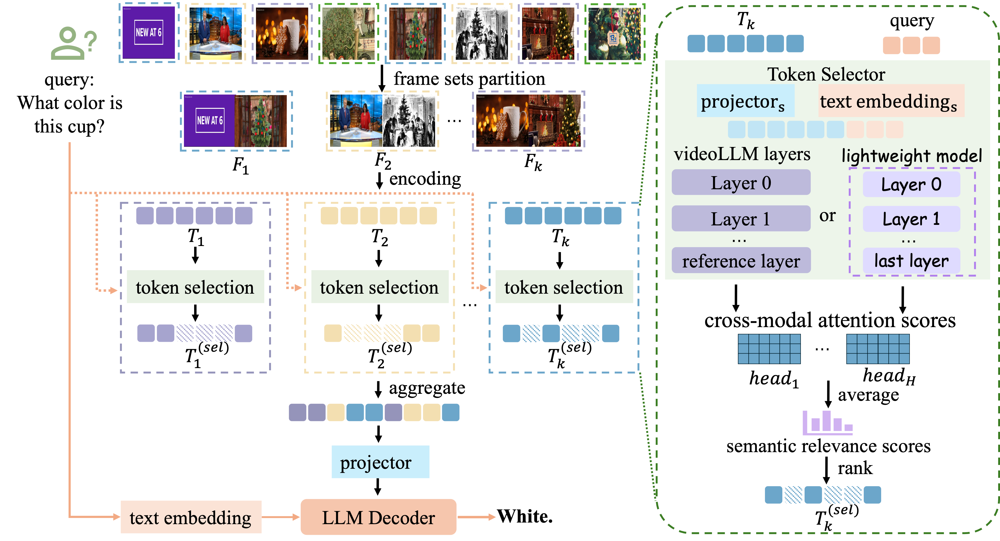

# FlexSelect
The official repository for paper "FlexSelect: Flexible Token Selection for Efficient Long Video Understanding".


[`Webpage`]() ｜ [`Paper`]()

## Introduction


We present FlexSelect, a flexible and efficient token selection method that leverages cross-modal attention scores in VideoLLMs to identify query-relevant visual tokens. Our approach combines: (1) training-free attention-based token ranking, and (2) a lightweight selector for fast filtering.

## Todo:
- [x] Evaluation Code release of FlexSelect with LLaVA-Vide, Qwen2.5VL, InternVL2.5.
- [x] Training Code release of FlexSelect with LLaVA-Vide, Qwen2.5VL, InternVL2.5.
- [ ] Visualization code release of FlexSelect with LLaVA-Vide, Qwen2.5VL, InternVL2.5.
- [ ] Release the trained token selector.


## Performance

We conduct experiments on three video LLMs (LLaVA-video, Qwen2.5VL, InternVL2.5) under for benchmarks: LongVideoBench, VideoMME, LVbench, MLVU.

# Comprehensive Evaluation on Long Video Benchmarks

| Model | Size | VideoMME (Long) | VideoMME (Overall) | MLVU (M-Avg) | LongVB (Val) | LVBench (Test) |
|-------|------|-----------------|--------------------|--------------|--------------|----------------|
| **Proprietary Models** ||||||
| GPT-4o   | - | 65.3 | 71.9 | 64.6 | 66.7 | 34.7 |
| Gemini-1.5-Pro   | - | **67.4** | **75.0** | - | 64.0 | 33.1 |
| **Open-Source VideoLLMs** ||||||
| mPLUG-Owl3   | 7B | 50.1 | 59.3 | 63.7 | 52.1 | 43.5 |
| Qwen2-VL   | 7B | 53.8 | 63.3 | 66.9 | 55.6 | 42.4 |
| NVILA   | 8B | 54.8 | 64.2 | 70.1 | 57.7 | - |
| VideoLLaMA3   | 7B | - | 66.2 | 73.0 | 59.8 | 45.3 |
| Aria   | 8×3.5B | 58.8 | 67.6 | 70.6 | 65.3 | - |
| Oryx-1.5   | 34B | 59.3 | 67.3 | 72.3 | 62.0 | 30.8 |
| Video-XL-Pro   | 3B | - | 60.0 | 70.6 | 56.7 | - |
| SF-LLaVA-1.5   | 7B | - | 63.9 | 71.5 | 62.5 | 45.3 |
| TPO   | 7B | 55.4 | 65.6 | 71.1 | 60.1 | - |
| Quato   | 7B | 55.7 | 65.9 | 71.9 | 59.0 | - |
| ViLAMP   | 7B | 57.8 | 67.5 | 72.6 | 61.2 | 45.2 |
| **LLaVA-Video** | 7B | 52.9 | 64.4 | 68.6 | 58.2 | 43.1 |
| + FlexSelect | 7B | 59.8 (↑6.9) | 68.9 (↑4.5) | 73.2 (↑4.6) | 61.9 (↑3.7) | 52.9 (↑9.8) |
| + FlexSelect-Lite | 7B | 58.3 (↑5.4) | 68.3 (↑3.9) | 71.8 (↑3.2) | 60.7 (↑2.5) | 52.2 (↑9.1) |
| **InternVL2.5** | 8B | 52.8 | 64.2 | 68.9 | 59.5 | 43.4 |
| + FlexSelect | 8B | 58.1 (↑5.3) | 67.0 (↑2.8) | 71.9 (↑3.0) | 60.1 (↑0.6) | 49.7 (↑6.3) |
| + FlexSelect-Lite | 8B | 57.9 (↑5.1) | 67.2 (↑3.0) | 71.9 (↑3.0) | 61.2 (↑1.7) | 49.9 (↑6.5) |
| **Qwen2.5-VL** | 7B | 55.6 | 65.4 | 70.2 | 59.5 | 45.3 |
| + FlexSelect | 7B | 59.3 (↑3.7) | 68.2 (↑2.8) | 72.5 (↑2.3) | 62.4 (↑2.9) | 51.2 (↑5.9) |
| + FlexSelect-Lite | 7B | 58.6 (↑3.0) | 67.4 (↑2.0) | 70.3 (↑0.1) | 61.9 (↑2.4) | 50.0 (↑4.7) |
| **LLaVA-Video** | 72B | 61.9 | 70.0 | 71.2 | 62.4 | 45.5 |
| + FlexSelect | 72B | 66.1 (↑4.2) | 73.1 (↑3.1) | 76.0 (↑4.8) | **66.9** (↑4.5) | 55.5 (↑10.0) |
| **Qwen2.5 VL** | 72B | 63.9 | 73.4 | 76.3 | 66.2 | 47.3 |
| + FlexSelect | 72B | 66.9 (↑3.0) | 74.4 (↑1.0) | **76.6** (↑0.3) | 66.4 (↑0.2) | **56.6** (↑9.3) |


## Data Preparation

All four used benchmarks can be downloaded from huggingface website: [`LongVideoBench`](https://huggingface.co/datasets/longvideobench/LongVideoBench), [`VideoMME`](https://huggingface.co/datasets/lmms-lab/Video-MME), [`MLVU`](https://huggingface.co/datasets/MLVU/MVLU), and [`LVBench`](https://huggingface.co/datasets/THUDM/LVBench).

## Pretrained Model

The pretrained model can be found in their respective repositories: [`LLaVA-Video-7B`](https://huggingface.co/lmms-lab/LLaVA-Video-7B-Qwen2), [`LLaVA-Video-72B`](https://huggingface.co/lmms-lab/LLaVA-Video-72B-Qwen2), [`InternVL2.5-8B`](https://huggingface.co/OpenGVLab/InternVL2_5-8B), [`Qwen2.5VL-7B`](https://huggingface.co/Qwen/Qwen2.5-VL-7B-Instruct) and [`Qwen2.5VL-72B`](https://huggingface.co/Qwen/Qwen2.5-VL-72B-Instruct)..

## evaluation

FlexSelect works in two modes: training-free mode and lightweight mode.  We evaluate them using LMMS-Eval. We follow the environment installation guideline of [`LMMS-EVAL`](https://github.com/EvolvingLMMs-Lab/lmms-eval/blob/main/README.md#installation).

run command 
```bash 
sh eval/scripts/training_free/eval_llavavideo.sh 
sh eval/scripts/training_free/eval_internvl2_5.sh 
sh eval/scripts/training_free/eval_qwenvl2_5.sh
```
to reproduce our result.

Here are explanations of variants in our eval scripts:

| Parameter                 | Type       | Options / Notes                                                                 | Default  |
|---------------------------|------------|---------------------------------------------------------------------------------|----------|
| **`use_token_selector`**  | `boolean`  | - `true`: Enable FlexSelect token selection<br>- `false`: Disable (standard eval) | `false`  |
| **`token_selector_path`** | `string`   | - `"self"`: Training-free mode<br>- `"path/to/token selector model"`: Lightweight mode | `"self"` |
| **`token_selector_layer`**| `integer`  | reference layer number（only effective in **Training-free mode**）                                   | `-1`     |
| **`drop_func_name`**      | `string`   | ways to get semantic relevance score <br>- `"token_selection"`: average on head and text dimension<br>- `"token_selection_argmax"`: argmax on head and text dimension| `"token_selection"` |
| **`tkn_budget`**          | `integer`  | max selected tokens                                               | `6720`     |

Here are explanations of some commandline choice:

### 1. **Model Selection (`--model`)**
Specify the evaluation model with the following options:  

| Value          | Model Evaluated               |
|----------------|-------------------------------|
| `llava_vid`    | LLaVA-Video-7B                |
| `internvl2`    | InternVL2.5                   |
| `qwen2_5_vl`   | Qwen2.5VL                     |

### 2. **Task Selection (`--tasks`)**
| Value                  | Task Name          | Notes                              |
|------------------------|--------------------|------------------------------------|
| `videomme`             | Video-MME          | Standard video evaluation          |
| `mlvu_dev`             | MLVU               | Multi-language video understanding |
| `lvbench`              | LVBench            | Short-video benchmark              |
| `longvideobench_val_v` | LongVideoBench     | Default variant (e.g., for LLaVA)  |
| `longvideobench_val_i` | LongVideoBench     | **InternVL series only** (uses caption) |


## token selector training

FlexSelect trains 0.5B token selector for LLaVA-Video-7B, Qwen2.5VL-7B and InternVL2.5-8B.

We follow the environment installation guideline of corresponding project to construct training environment:

- LLaVA-Video: https://github.com/LLaVA-VL/LLaVA-NeXT?tab=readme-ov-file#2-install-the-inference-package
- Qwen2.5VL: https://github.com/QwenLM/Qwen2.5-VL/blob/main/qwen-vl-finetune/README.md
- InternVL2.5: https://internvl.readthedocs.io/en/latest/internvl2.5/finetune.html

```bash
# Step 1: Train LLaVA-Video selector
cd train/LLaVA-Video && sh scripts/train_selector.sh

# Step 2: Finetune Qwen2.5-VL
cd train/Qwen2.5-VL/qwen-vl-finetune && sh scripts/sft_7b.sh

# Step 3: Finetune InternVL (dynamic resolution)
cd train/InternVL/internvl_chat && sh shell/internvl2.5/2nd_finetune/internvl2_5_8b_dynamic_res_2nd_finetune_full.sh
```

The training data can be found at:...
We will release our trained token selector model.


## Acknowledgement

This repository is built upon [`LMMS-EVAL`](https://github.com/EvolvingLMMs-Lab/lmms-eval), [`LLaVA-Video`](https://github.com/LLaVA-VL/LLaVA-NeXT), [`InternVL2.5`](https://github.com/OpenGVLab/InternVL), and [`Qwen2.5VL`](https://github.com/QwenLM/Qwen2.5-VL). Thanks for those well-organized codebases.

## License

FlexSelect is released under the [`CC BY-NC-SA 4.0 license`](https://creativecommons.org/licenses/by-nc-sa/4.0/).

## Citation

